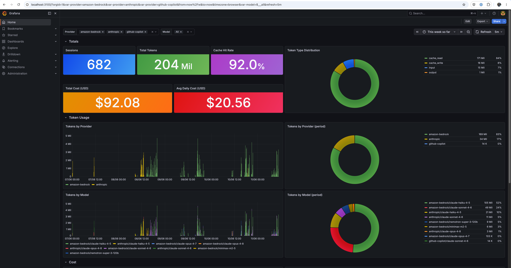

# OpenCode Metrics Dashboard

A complete metrics collection and visualization stack for [OpenCode](https://github.com/anomalyco/opencode), consisting of:

- **Metrics Exporter**: A Bun/TypeScript service that polls the OpenCode SQLite database every 60 seconds and exports metrics to Prometheus via the remote write protocol
- **Prometheus**: Time-series database configured with 2-year retention and support for out-of-order samples (covers full OpenCode history)
- **Grafana**: Auto-refreshing visualization dashboard (every 60 seconds) with provider and model filters, displaying token usage, costs, and session analytics

## Prerequisites

- Docker and Docker Compose
- OpenCode with an active `opencode.db` database at `~/.local/share/opencode/opencode.db`

## Quick Start

```bash
docker compose up -d
```

This starts three services:

- **Grafana**: http://localhost:3100 (default login: `admin` / `admin`)
- **Prometheus**: http://localhost:9090

The metrics exporter automatically begins polling your OpenCode database and pushing metrics to Prometheus every 60 seconds. The Grafana dashboard auto-refreshes every 60 seconds to display live data.

## Dashboard

The Grafana dashboard provides real-time insights into your OpenCode usage with automatic 60-second synchronization:



**Features:**
- **Totals**: Session count, total tokens, and cache hit rate
- **Cost Metrics**: Total spend and daily average cost
- **Token Usage**: Time-series graphs of token consumption by provider and model
- **Token Distribution**: Pie charts showing breakdown by token type and model
- **Dynamic Filters**: Provider and model dropdowns for focused analysis

## Architecture

```
OpenCode DB (read-only)
    ↓
Metrics Exporter (polls every 60s)
    ↓
Prometheus (remote write receiver)
    ↓
Grafana (auto-refreshes every 60s)
```

## Configuration

Edit `docker-compose.yml` to adjust:

- `POLL_INTERVAL_MS`: How often the exporter polls OpenCode (default: 60000ms)
- `BATCH_SIZE`: Number of metrics per remote write batch (default: 500)
- `GF_SECURITY_ADMIN_PASSWORD`: Grafana admin password (default: `admin`)
- Retention times: Update Prometheus command flags or Grafana time ranges as needed

## Volumes

- `prometheus_data`: Prometheus time-series storage
- `grafana_data`: Grafana dashboards, settings, and plugins
- `metrics_state`: Exporter watermark state (prevents duplicate exports)

## Cleanup

To stop all services:

```bash
docker compose down
```

To remove volumes and data:

```bash
docker compose down -v
```
